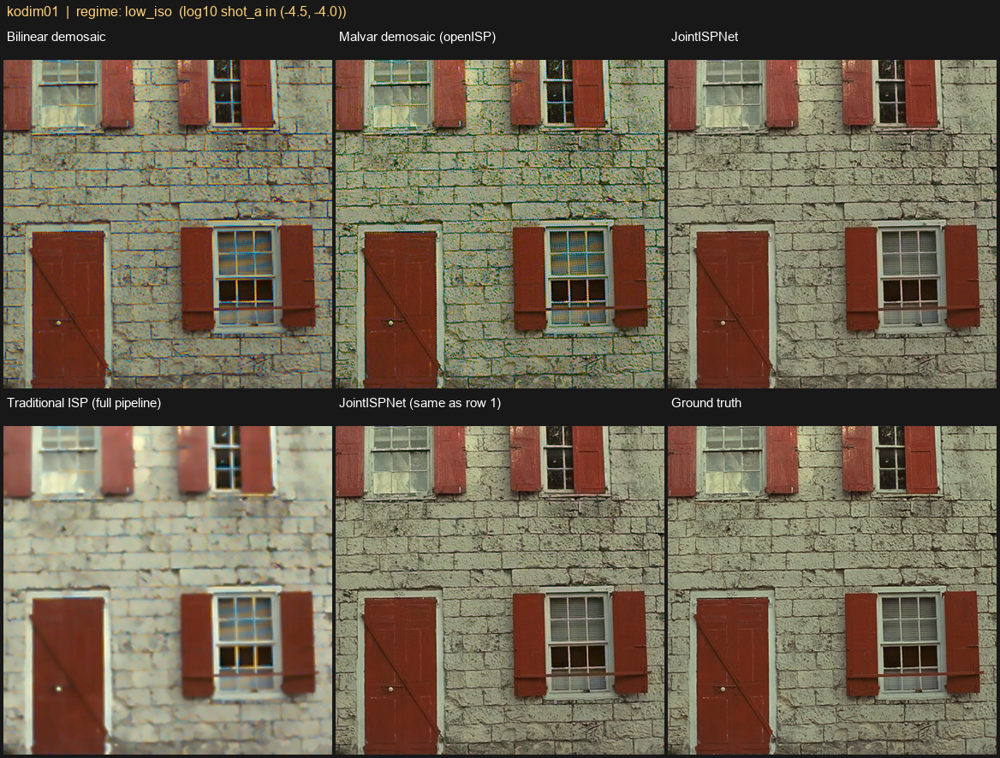
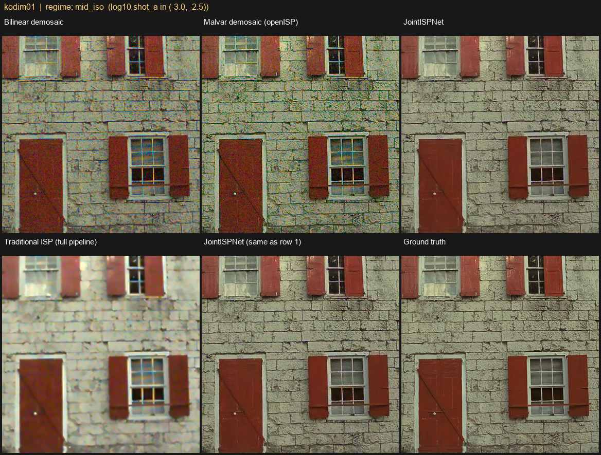
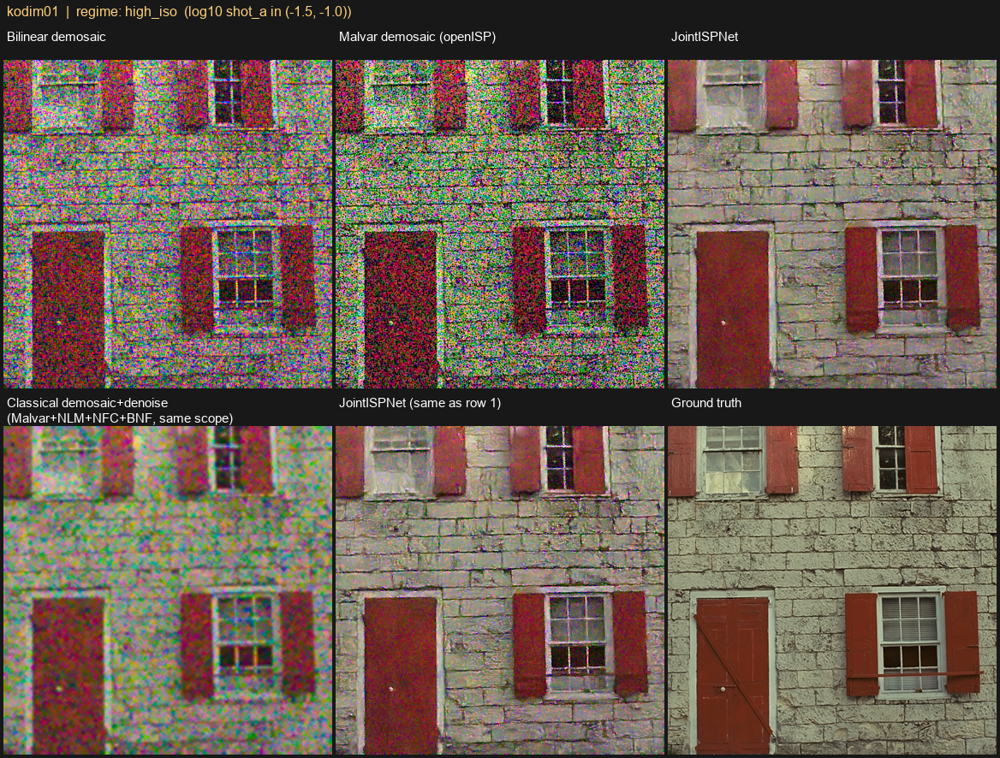

# neuralisp

A neural ISP built from scratch: joint demosaic and denoise on synthetic
Bayer RAW, trained and evaluated entirely on open-source data.

## Scope: demosaic+denoise only

```
RAW (post-BLC/LSC/defect-correction, classical)
   |
   v
[ NEURAL: joint demosaic + denoise ]   <-- this project
   |
   v
linear RGB, camera-native, pre-WB
   |
   v
WB -> CCM -> tone curve -> LTM -> sharpen   (classical, tunable)
```

Demosaic and denoise are learned together, as one network, because they
act on the same signal. Demosaic-first correlates noise across channels
before the denoiser sees it. Denoise-first destroys the Bayer structure
demosaic needs. One network from packed Bayer to linear RGB avoids both
and beats the classical cascade in the literature.

White balance, color correction, and tone mapping stay classical. These
are product knobs that change often, and baking them into network weights
would turn every tuning request into a retrain. Kept as parametric
blocks, they stay instantly tunable.

The forward model in
[`neuralisp/data/degradation.py`](neuralisp/data/degradation.py) (noise
calibration, color matrices, white balance) determines whether the
synthetic training data is realistic.

## Architecture

`neuralisp/models/unet.py`, `JointISPNet`:

- **Input**: packed RGGB Bayer (4ch) plus a broadcast noise-level map
  (2ch: shot and read noise, from ISO/gain, not estimated). 6 channels
  total.
- **Body**: U-Net. Strided-conv encoder, PixelShuffle decoder, residual
  blocks, skip connections. 4 levels, channel multipliers (1,2,4,8),
  32-channel base, ~8.6M params.
- **Output**: a residual on top of a bilinear demosaic baseline,
  PixelShuffled to full resolution. Stabilizes training and gives a safe
  fallback.
- **Loss**: L1 (dominant) plus MS-SSIM, in gamma-compressed space (linear
  space over-weights bright regions). See `neuralisp/losses.py`.

## Forward degradation model

Real RAW pairs at scale are scarce (SIDD, DND, HDR+ run tens to hundreds
of GB, with licensing overhead). This project uses unprocessing (Brooks
et al., CVPR 2019) instead: invert a clean sRGB photo back to a plausible
RAW.

```
clean sRGB -> inverse gamma -> inverse CCM -> inverse WB -> mosaic (RGGB) -> + calibrated noise
```

Noise is signal-dependent: `var(I) = shot_a * I + read_b`, sampled from
the log-linear relationship calibrated in Foi et al. / Brooks et al. CCM
and white-balance gains are randomized per sample from a small bank of
camera matrices, so the network doesn't overfit to one sensor.

This runs on-the-fly, batched, on GPU, inside the training loop, so every
epoch sees a fresh realization. See `neuralisp/data/degradation.py`;
round-trip and shape correctness are covered in
`tests/test_degradation.py`. Supervision target: camera-native linear RGB,
before WB/CCM.

## Data

Fetched by [`scripts/download_data.py`](scripts/download_data.py):

| Split | Source | Count | Role |
|---|---|---|---|
| train | [BSDS500](https://github.com/BIDS/BSDS500) | 502 images | patch source (random 128x128 crops, 8/image/epoch) |
| test | [Kodak](https://r0k.us/graphics/kodak/) | 24 images | primary held-out eval |
| test | [CBSD68](https://github.com/clausmichele/CBSD68-dataset) | 68 images | secondary held-out eval |

Re-run anytime; idempotent.

## Project layout

```
neuralisp/
  data/
    degradation.py   forward model: sRGB -> synthetic noisy Bayer RAW
    datasets.py       PatchTrainDataset, FullImageTestDataset
  models/
    blocks.py         residual/down/up blocks
    unet.py           JointISPNet
  losses.py            gamma-space L1 + MS-SSIM
  metrics.py           PSNR, SSIM
  train.py             training loop, checkpointing, TensorBoard
  evaluate.py           held-out eval across simulated ISO regimes
scripts/
  download_data.py     fetch Kodak / CBSD68 / BSDS500
tests/                  unit tests for degradation math, model shapes, losses
data_raw/               downloaded datasets (gitignored)
checkpoints/<run>/      best.pt, latest.pt
runs/<run>/             TensorBoard logs
outputs/<run>/          qualitative PNG samples
```

## Usage

```powershell
# one-time setup
python -m venv venv
venv\Scripts\pip install -r requirements.txt
python scripts\download_data.py

# train
venv\Scripts\python -m neuralisp.train --epochs 100 --batch-size 16 --patch-size 128

# evaluate a checkpoint, low/mid/high-ISO, on Kodak and CBSD68
venv\Scripts\python -m neuralisp.evaluate --checkpoint checkpoints\<run>\best.pt --dataset data_raw\test\kodak
venv\Scripts\python -m neuralisp.evaluate --checkpoint checkpoints\<run>\best.pt --dataset data_raw\test\cbsd68

# watch training
venv\Scripts\tensorboard --logdir runs
```

`train.py --max-steps N --limit-val M` runs a fast smoke test instead of a
full run.

## Results

100 epochs, `JointISPNet` (8.6M params, base_channels=32), evaluated on
two held-out sets across three simulated noise regimes:

| Dataset | Regime | Net PSNR | Net SSIM | Bilinear PSNR | Bilinear SSIM | Δ PSNR |
|---|---|---|---|---|---|---|
| Kodak (24) | low ISO | 42.67 dB | 0.9888 | 33.79 dB | 0.9313 | +8.88 dB |
| Kodak (24) | mid ISO | 38.69 dB | 0.9662 | 32.37 dB | 0.8730 | +6.32 dB |
| Kodak (24) | high ISO | 29.93 dB | 0.7867 | 23.41 dB | 0.4465 | +6.52 dB |
| CBSD68 (68) | low ISO | 42.26 dB | 0.9905 | 32.87 dB | 0.9188 | +9.39 dB |
| CBSD68 (68) | mid ISO | 37.96 dB | 0.9692 | 31.37 dB | 0.8676 | +6.59 dB |
| CBSD68 (68) | high ISO | 28.97 dB | 0.7891 | 22.92 dB | 0.4755 | +6.06 dB |

The gap grows sharply at high ISO (SSIM 0.79 vs. 0.45-0.48): bilinear is
heavily noise-corrupted there, the network stays close to ground truth.
Performance is consistent between Kodak and CBSD68, the generalization
check that matters since CBSD68 was never used for training or tuning.

Full numbers: `outputs/eval/<dataset>/results.json`. Qualitative triplets
(bilinear, prediction, ground truth): `outputs/eval/<dataset>/<regime>/*.png`.

**Caveat**: PSNR/SSIM here only validate that the network inverts this
project's own forward model. Not a substitute for real-sensor validation,
texture metrics, or a human panel. See "What's missing for production."

## The retraining problem

A classical ISP has parameters you nudge and rebuild in an afternoon. This
network has weights: a bad result means change the data, retrain,
re-validate everything. Design choices here exist to blunt that:

- **Noise-level conditioning** covers an ISO range with one model, so most
  "wrong at high ISO" complaints are a data problem, not architecture.
- **WB/CCM/tone kept classical** means color and contrast requests never
  touch the network.
- **A fixed, versioned held-out set** (Kodak + CBSD68, via `evaluate.py`)
  is the minimum viable regression harness.

The missing piece for real deployment is the data-centric loop: triage a
failure, capture more of that failure class, retrain, re-run the
regression set. That loop, not the architecture, is what production teams
spend most of their time on.

## What's missing for production

Solo/portfolio-scoped. Honest gaps:

- **Real sensor data.** Everything here is synthetic. Real deployment
  finetunes on real RAW pairs (e.g. SIDD) since no forward model matches a
  sensor's PRNU, defect pixels, or read-noise exactly.
  [`neuralisp/data/datasets.py`](neuralisp/data/datasets.py) is structured
  so a `RealPairedRawDataset` can drop in alongside `PatchTrainDataset`.
- **Lens-specific degradation.** No PSF/CA/flare modeling. A measured
  blur kernel would turn this into denoise+demosaic+deblur.
- **Quantization / on-device deployment.** No INT8/QAT export. Restoration
  networks are unusually sensitive to quantization since they operate on
  small residuals.
- **Texture/acutance and perceptual eval.** Only PSNR/SSIM here. A real
  harness needs dead-leaves acutance, ISO 15739 visual noise, SFR, and a
  blind panel.
- **Video temporal consistency.** Single-frame only.

## Traditional ISP baseline

`reference_isp/` runs a real classical ISP on the same synthetic test
inputs as `neuralisp.evaluate`, so `JointISPNet` gets compared against a
real pipeline, not just the bilinear strawman above.

**What's here:**

- `fast-openISP/`: a fork of
  [QiuJueqin/fast-openISP](https://github.com/QiuJueqin/fast-openISP) (MIT
  licensed, forked from commit `26fd824`, 2023-06-21). Adds `lsc` (lens
  shading correction) and `nfc` (chroma noise reduction, a
  local-neighborhood outlier filter on Cb/Cr), neither present upstream.
  Rewrote `bcc` and `hsc` (min-max stretch contrast, floating-point
  hue/saturation, replacing the original fixed-point x256 gains).
  Pipeline: DPC, BLC, LSC, AAF, AWB, CNF, CFA (Malvar), CCM, GAC (gamma),
  CSC, NLM, NFC, BNF, CEH, EEH, FCS, HSC, BCC. Full history:
  [yumiao0557/fast-openISP](https://github.com/yumiao0557/fast-openISP).
- `compare_traditional_isp.py`: reuses this project's own `degrade()` for
  a noisy Bayer mosaic, runs it through fast-openISP with a matched
  config, and produces a 4-way comparison against bilinear, `JointISPNet`,
  and ground truth.
- `compare_demosaic_denoise.py`: splits that comparison into demosaic
  alone and denoise alone, since the full pipeline confounds both.

**Matched conditions:** fast-openISP gets the same per-image white-balance
gains and CCM that `degrade()` sampled, so differences reflect
demosaic/denoise quality, not color mismatch. DPC and LSC are disabled:
this project's noise model has no dead pixels or vignetting, so both
would add an effect rather than correct a real defect. NFC stays enabled,
since chroma noise is actually simulated here.

```powershell
venv\Scripts\python reference_isp\compare_traditional_isp.py --checkpoint checkpoints\joint_isp_v1\best.pt --dataset data_raw\test\kodak
venv\Scripts\python reference_isp\compare_traditional_isp.py --checkpoint checkpoints\joint_isp_v1\best.pt --dataset data_raw\test\cbsd68
venv\Scripts\python reference_isp\compare_demosaic_denoise.py --checkpoint checkpoints\joint_isp_v1\best.pt --dataset data_raw\test\kodak
venv\Scripts\python reference_isp\compare_demosaic_denoise.py --checkpoint checkpoints\joint_isp_v1\best.pt --dataset data_raw\test\cbsd68
```

**Results (24 Kodak, 68 CBSD68, matched conditions):**

| Dataset | Regime | Bilinear | Malvar (openISP) | Traditional ISP (full) | JointISPNet |
|---|---|---|---|---|---|
| Kodak | low ISO | 25.18 dB / 0.748 | **26.05 dB / 0.845** | 23.22 dB / 0.698 | **35.62 dB / 0.967** |
| Kodak | mid ISO | 22.97 dB / 0.539 | 23.19 dB / 0.633 | 23.09 dB / 0.644 | **32.17 dB / 0.911** |
| Kodak | high ISO | **13.97 dB** / 0.143 | 13.70 dB / 0.197 | 18.90 dB / 0.333 | **22.11 dB / 0.491** |
| CBSD68 | low ISO | 24.19 dB / 0.738 | **25.12 dB / 0.844** | 20.98 dB / 0.674 | **35.25 dB / 0.973** |
| CBSD68 | mid ISO | 22.28 dB / 0.553 | 22.61 dB / 0.658 | 20.91 dB / 0.629 | **31.84 dB / 0.922** |
| CBSD68 | high ISO | **14.22 dB** / 0.169 | 14.12 dB / 0.237 | 18.63 dB / 0.367 | **22.05 dB / 0.533** |

Traditional ISP runs with `nfc` enabled throughout (see the ablation
below for its isolated effect).

At low and mid ISO the traditional pipeline scores below plain bilinear,
despite using Malvar demosaic and real denoise stages. At low noise,
demosaic/denoise error is tiny for both, so the dominant error source is
fast-openISP's own tone response: GAC uses a fixed gamma (0.42) instead of
an exact sRGB curve, EEH and CEH push pixel values away from a flat
rendering, and `nfc` smooths chroma detail that isn't yet noise. These are
standard ISP behaviors that often look better to a human but cost
PSNR/SSIM against a literal ground truth. Only at high ISO does the
pipeline pull ahead of bilinear.

At high ISO, `JointISPNet` still wins by a wide margin (22.1dB vs 18.9dB,
SSIM 0.49 vs 0.33). NLM and BNF only denoise luma, and `nfc`'s gain is
modest, so chroma noise still passes through more than in the joint
network's output.

**Does chroma noise reduction help?** `nfc` compares each Cb/Cr pixel to
its 8-neighbor mean/std and blends toward the mean past `thresh` standard
deviations (`alpha=0.3`, `thresh=2.5`). Isolating its effect means holding
`bcc`/`hsc` fixed and only toggling `nfc`:

| Dataset | Regime | nfc off | nfc on | Δ |
|---|---|---|---|---|
| Kodak | low ISO | 23.20 dB / 0.6972 | 23.22 dB / 0.698 | +0.02 dB |
| Kodak | mid ISO | 23.07 dB / 0.6415 | 23.09 dB / 0.644 | +0.02 dB |
| Kodak | high ISO | 18.80 dB / 0.3273 | 18.90 dB / 0.333 | +0.10 dB |
| CBSD68 | low ISO | 20.96 dB / 0.6733 | 20.98 dB / 0.674 | +0.02 dB |
| CBSD68 | mid ISO | 20.90 dB / 0.6275 | 20.91 dB / 0.629 | +0.01 dB |
| CBSD68 | high ISO | 18.56 dB / 0.3615 | 18.63 dB / 0.367 | +0.07 dB |

Isolated, `nfc`'s effect is small and consistently non-negative: a few
hundredths of a dB at low/mid ISO, growing to +0.07-0.10dB at high ISO,
where there's more real noise to catch. NLM/BNF already do most of the
denoising before `nfc` runs, so little residual chroma noise is left, and
the filter's blend (`alpha=0.3`) is conservative by design.

The multi-dB drop from the pre-fork baseline (e.g. Kodak low ISO 25.04dB
to 23.22dB) is not `nfc`. It's the `bcc` rewrite. The original `bcc`, at
its default `contrast_gain=256`, is a mathematical no-op:
`(y - median) * 256 >> 8 == y - median`. The rewritten `bcc` always
performs a per-image min-max stretch, remapping the actual min/max luma
onto `[16, 235]` regardless of whether the image needed it. That real,
content-dependent transform, replacing an old default that did nothing,
accounts for nearly all of the regression. (`hsc` at its current defaults
is close to identity by construction, so it isn't a meaningful
contributor.)

**Caveat**: this is a full, representative ISP output, including
sharpening/contrast/hue stages `JointISPNet` doesn't attempt. That's
deliberate: the point is what a real classical pipeline outputs. But the
PSNR/SSIM gap includes those cosmetic stages, not just demosaic/denoise
fidelity. Read the qualitative strips, not just the table.

**Demosaic vs. end-to-end, isolated at every noise level:**
`compare_demosaic_denoise.py` produces a labeled 6-panel grid per test
image, per noise regime, so both questions get answered at every noise
level on the same input: row 1 is bilinear / Malvar (fast-openISP's `CFA`
module alone) / `JointISPNet`, all rendered through this project's own
`render_srgb()` so the only variable is the demosaic algorithm; row 2 is
traditional ISP (full pipeline, own rendering) / `JointISPNet` / ground
truth. `JointISPNet`'s panel is identical in both rows since it has no
separate demosaic-only mode.

| Dataset | Regime | Bilinear | Malvar (openISP) | Traditional ISP (full) | JointISPNet |
|---|---|---|---|---|---|
| Kodak | low ISO | 25.18 dB / 0.748 | **26.05 dB / 0.845** | 23.22 dB / 0.698 | **35.62 dB / 0.967** |
| Kodak | mid ISO | 22.97 dB / 0.539 | 23.19 dB / 0.633 | 23.09 dB / 0.644 | **32.17 dB / 0.911** |
| Kodak | high ISO | **13.97 dB** / 0.143 | 13.70 dB / 0.197 | 18.90 dB / 0.333 | **22.11 dB / 0.491** |
| CBSD68 | low ISO | 24.19 dB / 0.738 | **25.12 dB / 0.844** | 20.98 dB / 0.674 | **35.25 dB / 0.973** |
| CBSD68 | mid ISO | 22.28 dB / 0.553 | 22.61 dB / 0.658 | 20.91 dB / 0.629 | **31.84 dB / 0.922** |
| CBSD68 | high ISO | **14.22 dB** / 0.169 | 14.12 dB / 0.237 | 18.63 dB / 0.367 | **22.05 dB / 0.533** |

Same image (Kodak `kodim01`) across all three regimes:

**Low ISO**

**Mid ISO**

**Mid ISO**


Three findings:

1. **Malvar's advantage over bilinear shrinks and reverses as noise
   grows.** At low ISO Malvar wins clearly (26.05 vs 25.18dB): its
   gradient-corrected kernel reconstructs edges better than plain
   averaging. By high ISO its PSNR dips below bilinear's (13.70 vs
   13.97dB), though SSIM stays higher. Malvar's kernel has negative
   side-lobes for edge sharpening, which amplify noise along with edges;
   bilinear's plain averaging incidentally filters some noise out.
2. **The full pipeline only clearly beats undenoised demosaic once
   there's real denoising work to do, and that takes until high ISO.** At
   low ISO the full pipeline (23.22dB) scores well below isolated Malvar
   (26.05dB); at mid ISO it's still marginally below on PSNR, though
   ahead on SSIM. Its tone curve, sharpening, and the `bcc` rewrite's
   always-on contrast stretch cost more PSNR than the demosaic gains
   through mid ISO. Only at high ISO does NLM+BNF+NFC's denoising
   outweigh that cost.
3. **`JointISPNet` wins every regime and every task**: +9.6dB over the
   best classical demosaic at low ISO, +3.2dB over the full traditional
   pipeline at high ISO. The gap isn't from a better demosaic kernel; it's
   from denoising being joint, RGB, and learned, instead of a separate
   luma-only filter bolted on after.

## Tests

```powershell
venv\Scripts\python -m pytest tests -v
```

Covers degradation math, model forward-pass shapes, and loss/metric
sanity.
